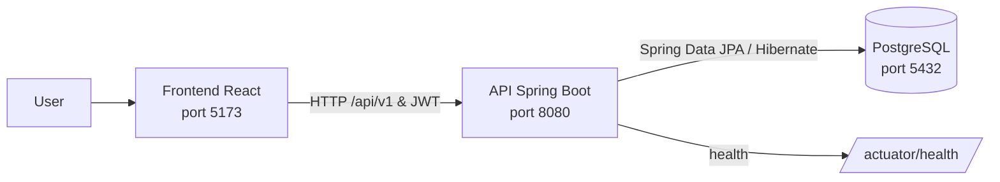

<details> 
	<summary><strong>Language - English</strong></summary>
	<br>
	<ul>
	    <li><a href="architecture.md">English</a></li>
        <li><a href="pt-BR/architecture.pt-BR.md">Português (Brasil)</a></li>
	</ul>
</details>
<br>

# Architecture

### Overview

Learnify is organized as three applications:

- `learnify-web`: React single-page application.
- `learnify-api`: Spring Boot REST API and Java tests.
- `learnify-db`: PostgreSQL image and SQL seed data.

Docker Compose starts the three services on a bridge network. The API waits for the database health check, and the web service waits for the API health check.

### Service communication

The browser uses Axios to call the API. The client reads `VITE_API_URL` and falls back to `http://localhost:8080`; it adds the `/api/v1` prefix to API requests. Authenticated requests send the JWT stored by the web application in the `Authorization` header.

On the backend, controllers delegate application behavior to services. Services use Spring Data JPA repositories, with Hibernate handling object-relational mapping to PostgreSQL. Spring Security protects authenticated resources, while JJWT is used to create and validate JWTs.



### Docker Compose services

| Service | Responsibility                                                         | Host port |
| ------- | ---------------------------------------------------------------------- | --------- |
| `db`    | PostgreSQL database, initialized with the database image and seed data | `5432`    |
| `api`   | Spring Boot API; exposes its health endpoint for service readiness     | `8080`    |
| `web`   | React/Vite development server                                          | `5173`    |

The Compose file also defines the `data` volume for PostgreSQL persistence and the `web_dependencies` volume for frontend dependencies. All services join the `net` bridge network.

### Directory structure

```text
.
├── compose.yml              # Local Docker Compose orchestration
├── learnify-api/            # Spring Boot API and Java tests
├── learnify-db/             # PostgreSQL image, local environment and SQL data
└── learnify-web/            # React SPA, unit tests and E2E tests
```

### Persistence and initialization

The API uses Spring Data JPA and Hibernate with PostgreSQL. The main profile is configured with `spring.jpa.hibernate.ddl-auto=update`. SQL seed data is loaded from the location supplied through `DATA_LOCATIONS`.
