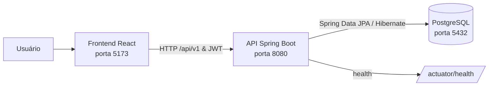

<details> 
	<summary><strong>Idioma - Português (Brasil)</strong></summary>
	<br>
	<ul>
	    <li><a href="../architecture.md">English</a></li>
        <li><a href="architecture.pt-BR.md">Português (Brasil)</a></li>
	</ul>
</details>
<br>

# Arquitetura

### Visão geral

O Learnify está organizado como três aplicações:

- `learnify-web`: aplicação de página única (SPA) em React.
- `learnify-api`: API REST Spring Boot e testes Java.
- `learnify-db`: imagem PostgreSQL e dados de seed SQL.

O Docker Compose inicia os três serviços em uma rede bridge. A API espera pela verificação de integridade do banco de dados, e o serviço web espera pela verificação de integridade da API.

### Comunicação entre serviços

O navegador usa Axios para chamar a API. O cliente lê `VITE_API_URL` e usa `http://localhost:8080` como fallback; ele adiciona o prefixo `/api/v1` às requisições da API. Requisições autenticadas enviam o JWT armazenado pela aplicação web no cabeçalho `Authorization`.

No backend, os controllers delegam o comportamento da aplicação aos services. Os services usam repositórios Spring Data JPA, com o Hibernate cuidando do mapeamento objeto-relacional para PostgreSQL. O Spring Security protege recursos autenticados, enquanto o JJWT é usado para criar e validar JWTs.



### Serviços do Docker Compose

| Serviço | Responsabilidade                                                              | Porta no host |
| ------- | ----------------------------------------------------------------------------- | ------------- |
| `db`    | Banco de dados PostgreSQL, inicializado com a imagem do banco e dados de seed | `5432`        |
| `api`   | API Spring Boot; expõe seu endpoint de health para prontidão do serviço       | `8080`        |
| `web`   | Servidor de desenvolvimento React/Vite                                        | `5173`        |

O arquivo Compose também define o volume `data` para persistência do PostgreSQL e o volume `web_dependencies` para dependências do frontend. Todos os serviços entram na rede bridge `net`.

### Estrutura de diretórios

```text
.
├── compose.yml              # Orquestração local do Docker Compose
├── learnify-api/            # API Spring Boot e testes Java
├── learnify-db/             # Imagem PostgreSQL, ambiente local e dados SQL
└── learnify-web/            # SPA React, testes unitários e testes E2E
```

### Persistência e inicialização

A API usa Spring Data JPA e Hibernate com PostgreSQL. O perfil principal é configurado com `spring.jpa.hibernate.ddl-auto=update`. Dados de seed SQL são carregados a partir do local fornecido por `DATA_LOCATIONS`.
